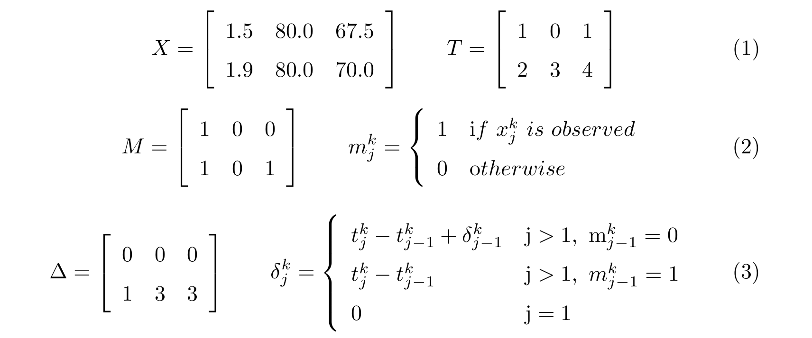
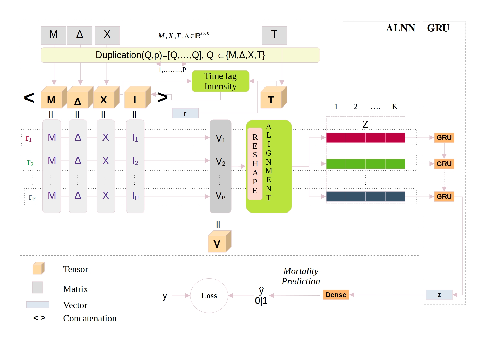

# ALNN-GRU
RNN models being designed for regular time series data, feeding the latter with the irregular ones, can significantly drop performance. To alleviate that drawback, we build a Alignment driven Neural Network (ALNN) on top of a RNN model. The ALNN, is a deep neural network that transforms irregular multivariate time series data into pseudo-aligned latent data. Next, this pseudo-aligned latent acting like a regular multivariate time series data, can be now fed in the RNN model.

# Data description
$X$->Observed and imputed values, $T$->timestamps, $M$->masks, $\Delta$->time variation across each channel.
To literally explain the coefficients of $X,T,M$ and $\Delta$ an example could be: the first value of the variable $k=1$, $x^1_1=1.5$, is a non inputted value $m^1_1=1$, observed at the timestamp $t^1_1=1$. The time interval between $x^1_1=1.5$ and $x^1_2=1.9$ is $\delta^1_2=1$.

# Architecture

# Steps to follow to launch the model
1. Run features_selection.py for data extraction
3. Run preprocessing.py to get the inputs and target features
   

