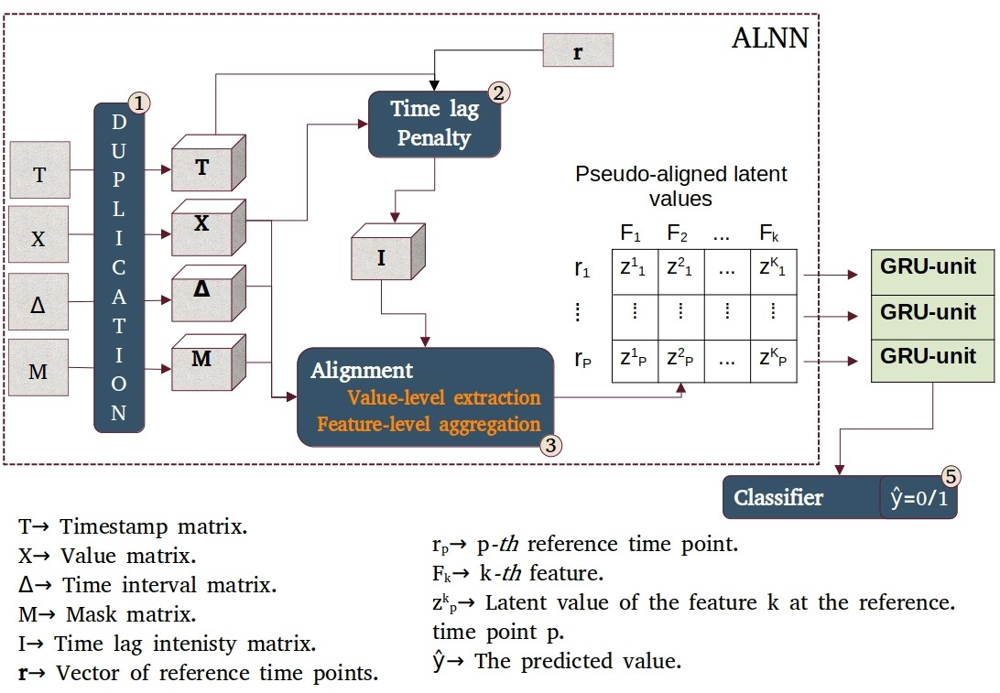

# ALNN-GRU
RNN models being designed for regular time series data, feeding the latter with the irregular ones, can significantly drop performance. To alleviate that drawback, we build a Alignment driven Neural Network (ALNN) on top of a RNN model. The ALNN, is a deep neural network that transforms irregular multivariate time series data into pseudo-aligned latent data. Next, this pseudo-aligned latent acting like a regular multivariate time series data, can be now fed in the RNN model.

# Data description
$X$->Observed and imputed values, $T$->timestamps, $M$->masks, $\Delta$->time variation across each channel.
To literally explain the coefficients of $X,T,M$ and $\Delta$ an example could be: the first value of the variable $k=1$, $x^1_1=1.5$, is a non inputted value $m^1_1=1$, observed at the timestamp $t^1_1=1$. The time interval between $x^1_1=1.5$ and $x^1_2=1.9$ is $\delta^1_2=1$.


# Architecture


# Steps to follow to launch the model
1. Get the MIMIC-3 database from https://physionet.org/content/mimiciii/1.4/ and place it in the data directory 
2. Run features_selection.py for data selection
```
python3 features_selection.py 
```
2. Run data_cleaning.py to replace outliers by nan. --prior-hours is in [24,48]
```
python3 data_cleaning.py --prior-hours 24
```
2. Run data_imputation.py to to impute outliers and initial missing values (i.e. not due to time irregularity).
```
python3 data_cleaning.py --prior-hours 24
```
3. Run samples_preparation.py to get the imput and target samples.
```
python3 samples_preparation.py --prior-hours 24
```
3. Run train.py to train the model. The time-ref-parameter set the reference time point vector. If: time-ref-parameter=1, Δr=1./time-ref-parameter=2, Δr=0.5/time-ref-parameter=3, Δr=0.33/time-ref-parameter=4, Δr=0.25/
```
python3 train.py --prior-hours 24 --time-ref-parameter 1
```


# Results 


# Test
```
function test() {
  console.log("notice the blank line before this function?");
}
```


